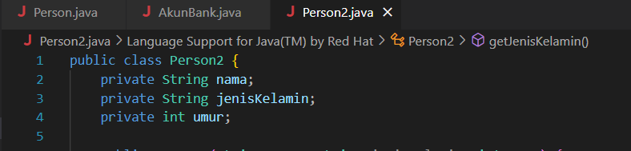
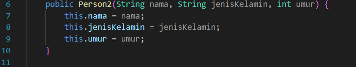
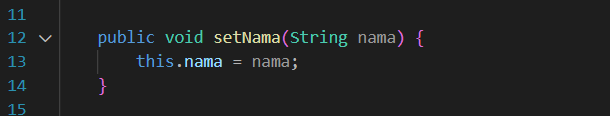
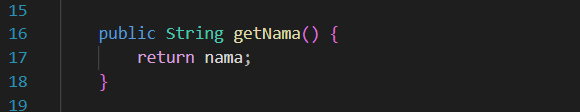
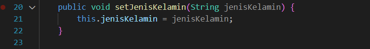
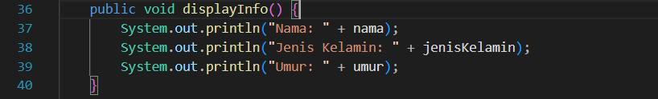
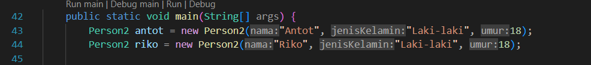
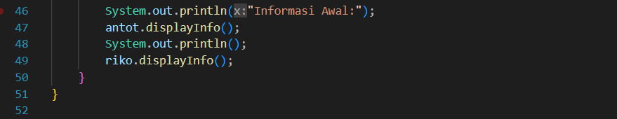

# praktikum2 person
```
NIM     : 312310576
NAMA    : TAUFIK HIDAYAT
KELAS   : TI.23.A6
MATKUL  : Pemrograman Orientasi Objek
```

## Latihan
-   Buat kode java mendeklarasikan class Person dgn atribut Nama, JenisKelamin, Umur. Lengkap dengan access modifier nya.
-   Lalu buat objek class person bernama Anton & Riko.

### Class Person
- Atribut
```
public class Person2 {

    private String nama;
    private String jenisKelamin;
    private int umur;
```


- Konstruktor
```
public Person2(String nama, String jenisKelamin, int umur) {
        this.nama = nama;
        this.jenisKelamin = jenisKelamin;
        this.umur = umur;
    }
```


- Setter Nama
```
public void setNama(String nama) {
        this.nama = nama;
    }
```


- Getter Nama
```
public String getNama() {
        return nama;
    }
```


- Setter JenisKelamin
```
public void setJenisKelamin(String jenisKelamin) {
        this.jenisKelamin = jenisKelamin;
    }
```


- Getter JenisKelamin
```
public String getJenisKelamin() {
        return jenisKelamin;
    }
```


- Setter Umur
```
public void setUmur(int umur) {
        this.umur = umur;
    }
```


- Getter Umur
```
public int getUmur() {
        return umur;
    }
```


- Menampilkan informasi person
```
public void displayInfo() {
        System.out.println("Nama: " + nama);
        System.out.println("Jenis Kelamin: " + jenisKelamin);
        System.out.println("Umur: " + umur);
    }
```


- Main method & membuat 2 objek untuk Anton&Riko
```
public static void main(String[] args) {
        Person2 antot = new Person2("Antot", "Laki-laki", 18);
        Person2 riko = new Person2("Riko", "Laki-laki", 18);
```


- menampilkan informasi awal
```
System.out.println("Informasi Awal:");
        antot.displayInfo();
        System.out.println();
        riko.displayInfo();
    }
}
```



# SELESAI
